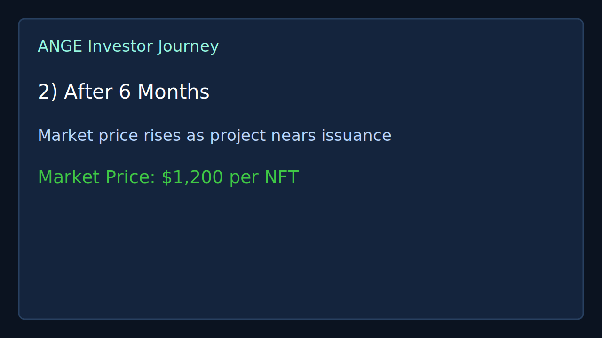
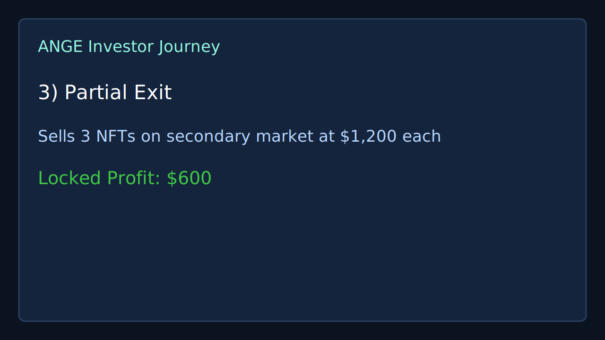
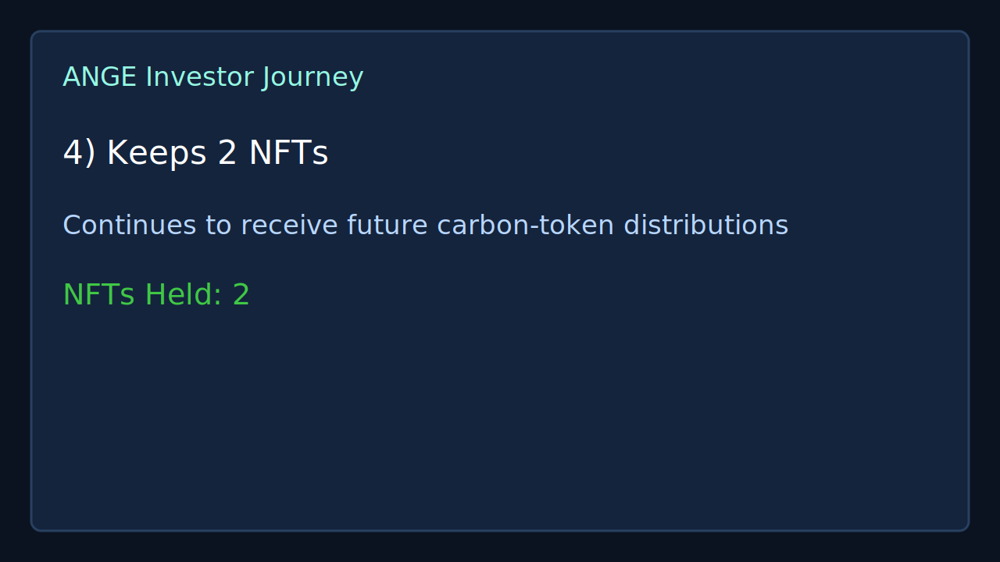
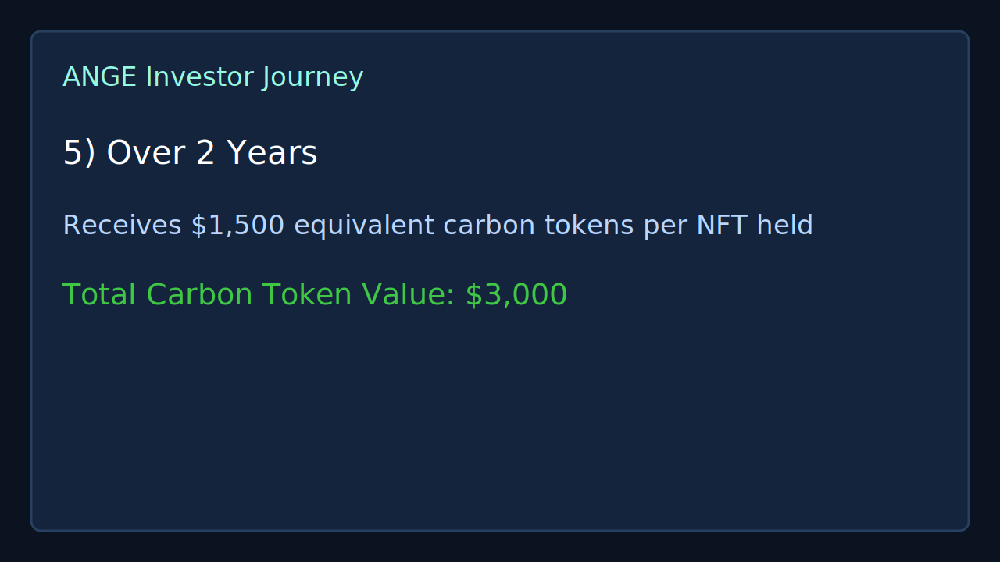
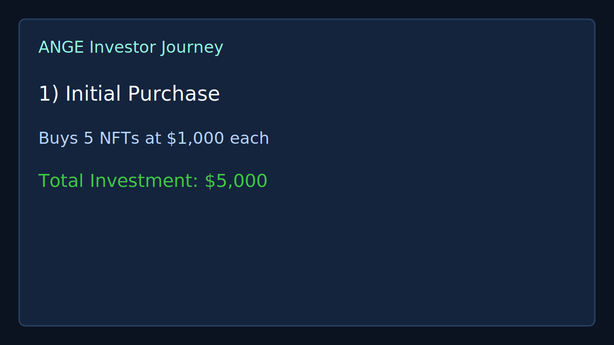

# ANGE — Asset Network for Green Economy

  

## Project Owner

**Project Owner: Veritas Ventures Trust (VVT)**  
Trustee: Veritas Tech Pty. Ltd.  
Website: www.veritas-tech.org

---

## Slide 1 — Project Introduction

### Detailed description
ANGE (Asset Network for Green Economy) is building a digital climate-finance infrastructure layer that connects real-world climate projects to internet-native capital markets. The platform is designed to tokenize climate-related assets and financing rights so that funding, settlement, and value distribution can happen on-chain with global access.

The introduction slide establishes three core ideas:
- **Tokenised climate bonds:** projects can issue blockchain-native instruments representing participation in future climate-asset generation.
- **Carbon market integration:** verified climate outcomes can be represented as tokenised carbon assets and distributed transparently.
- **Infrastructure-first approach:** ANGE focuses on market rails, not just a single product, aiming to support project developers, institutional participants, and digital investors.

This frames ANGE as a market infrastructure project with both impact and financial-return pathways.

---

## Slide 2 — Problem Statement

### Detailed description
The pitch identifies structural inefficiencies in traditional climate finance:
- **Slow settlement cycles** delay deployment of funding to projects.
- **High issuance and intermediation costs** reduce capital efficiency.
- **Limited liquidity** traps capital in long-duration structures.
- **Fragmented accessibility** limits participation from global digital investors.

As a result, three major stakeholders face friction:
1. **Project developers** need faster, lower-cost capital to execute and scale.
2. **Investors** need transparent liquidity options and clearer pricing signals.
3. **Carbon markets** need scalable, digital-first infrastructure for growth.

The second problem slide emphasizes the end-state of these frictions: climate assets become expensive, difficult to trade, and inaccessible to broader pools of capital.

---

## Slide 3 — Solution: Two Connected Markets

### Detailed description
ANGE proposes an integrated **two-market design**:

### 1) Primary Market — Carbon Credit / Token Market
- Climate projects advance through verification and carbon-credit generation.
- Verified credits are tokenised into digital carbon tokens.
- Tokens can be distributed and sold through multiple channels (native marketplace, existing marketplaces, institutional buyers, and global digital investors).

### 2) Secondary Market — Bond NFT Trading Market
- Projects issue **Bond NFTs** that represent proportional claims tied to future carbon-output value.
- Investors can trade these instruments before full carbon issuance/distribution is complete.
- This introduces ongoing liquidity and market pricing throughout the project lifecycle.

### Bond economics context
The deck’s bond-economics framing combines:
- **Discounted early financing** for project developers.
- **Project risk premium** for investors funding early-stage execution risk.
- **Funding return** tied to future carbon-token distributions.

Together, the model aims to align project funding needs with investor liquidity expectations.

---

## Slide 4 — Use Case & MVP Flow

### MVP flow screenshots (from `portal/screenshots`)

### Detailed description
The MVP demonstrates an end-to-end lifecycle:
1. A carbon project seeks upfront financing.
2. A bond issuance is unitised into Bond NFTs (e.g., U$100,000 split into 100 NFTs).
3. Investors fund the project by purchasing Bond NFTs.
4. The project generates verified carbon credits.
5. Credits are tokenised and distributed proportionally over time.
6. Bond NFTs remain tradable on secondary markets before full distribution.

The example scenario illustrates a hybrid return path:
- partial liquidity events via secondary sales,
- continued exposure to future token distributions via retained NFTs,
- risk-adjusted upside tied to project execution and market pricing.

---

## Slide 5 — Why Solana

### Detailed description
ANGE positions Solana as the operating layer for climate-finance markets because of four infrastructure characteristics:
- **Speed:** near real-time settlement supports active market operations.
- **Low fees:** makes smaller transactions and broader participation economical.
- **Scalability:** supports global, high-volume issuance and trading activity.
- **Accessibility:** internet-native rails connect cross-border participants.

Strategically, this supports a bridge from traditional carbon and institutional markets into programmable internet capital markets.

---

## Vision

### Detailed description
ANGE’s long-term vision is to build foundational infrastructure for tokenised climate finance by enabling:
- **Global climate project financing** through digitally native instruments.
- **Transparent and liquid participation** for institutional and digital investors.
- **Interoperable carbon-market rails** where real-world climate outcomes map cleanly to on-chain assets.

In this vision, climate assets become more financeable, more transparent, and more globally accessible—expanding both climate impact and investable market depth.
